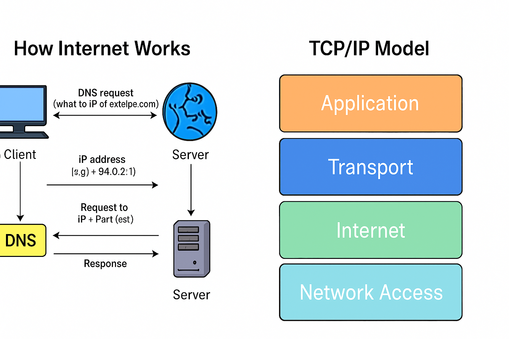

# 🌐 Internet & Servers Guide

This project explains how the Internet works and what servers are, designed for Linux/DevOps beginners.

## 📖 Topics Covered

- How the Internet works (Client-Server model, DNS, IP, Port)
- What are servers? (Web server, database server, file server, etc.)
- Basic commands to explore networking on Linux

### 📊 How Internet Works

## 🛠️ How to Use

- View `notes/internet_and_servers.md` for detailed concepts.
- Use `scripts/` to test networking tools on Linux.

## 📊 Diagrams

See `diagrams/` folder for visual reference.
